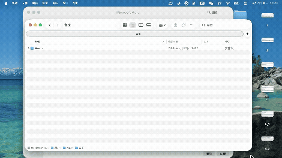

# MissionX

Close buttons and keyboard shortcuts for macOS Mission Control.

macOS shows you every open window in Mission Control but gives you no way to act
on them — you can only pick one. MissionX adds a ⊗ badge to each thumbnail and a
set of keyboard shortcuts, so you can tidy up your windows from the one place
where you can actually see all of them.



## Features

- **⊗ on every window thumbnail** — click to close, without leaving Mission Control
- **⊗ on removable desktops** — close a whole space from the spaces strip
- **Keyboard shortcuts** on the window under the pointer:
  | Key | Action |
  | --- | --- |
  | `⌘W` | Close the window |
  | `⌘M` | Minimize the window |
  | `⌘Q` | Quit the window's application |
- **Keyboard navigation** — arrow keys and `Tab`/`⇧Tab` move a highlight between
  windows, `↵` switches to the selected one. Moving the mouse hands control back
  to the pointer.
- Menu bar item, launch at login, no Dock icon.

Closing presses the window's own close button, so "you have unsaved changes"
dialogs still appear. Nothing is force-killed.

## Requirements

- macOS 14 or later. Developed and tested on **macOS 26.5 (Tahoe)**.
- **Command Line Tools only — Xcode is not required.**
- Accessibility permission, which the app asks for on first launch.

## Build and install

```bash
git clone https://github.com/wsr3/missionx.git
cd missionx
./dev-cert.sh     # one-time: create a local code-signing identity
./build.sh        # produces build/MissionX.app
open build/MissionX.app
```

Then grant Accessibility permission when prompted (System Settings → Privacy &
Security → Accessibility). Move `build/MissionX.app` wherever you like, e.g.
`/Applications`.

### Why `dev-cert.sh`?

macOS remembers Accessibility permission per **code-signing identity**. An
ad-hoc signature (`codesign -s -`) gets a new hash on every rebuild, so the
permission you just granted is silently void the next time you compile — the
switch stays on in System Settings while the app gets denied.

`dev-cert.sh` creates a self-signed code-signing certificate in your login
keychain and trusts it for code signing. The identity is then stable across
rebuilds and you only grant permission once. `build.sh` falls back to ad-hoc
signing (with a warning) if the identity is missing.

## How it works

None of this has a documented API; the following is what works as of macOS 26.

**Mission Control's contents come from the Dock.** It is not a normal window, but
the Dock exposes the whole thing through the Accessibility API. The `mc` node
exists only while Mission Control is open, which is also how MissionX detects it —
polled every 200 ms, since the Dock posts no reliable notifications for it.

```
AXApplication "Dock"
└─ AXGroup id="mc"                 ← only while Mission Control is open
   └─ AXGroup id="mc.display"
      ├─ AXGroup id="mc.windows"   → one AXButton per window, with exact frames
      └─ AXGroup id="mc.spaces"
         └─ AXList id="mc.spaces.list"
            └─ AXButton            → one per desktop; removable ones expose
                                      an "AXRemoveDesktop" action
```

**Thumbnails are matched to real windows by geometry, not by title.** Titles are
unusable — Mission Control truncates them, decorates them, and some windows have
none. But while it is open, the window server reports each real window's
on-screen bounds as its *thumbnail's* bounds, so an exact match against
`CGWindowListCopyWindowInfo` identifies the window. Filter to `layer == 0` or the
Dock's backdrop (layers 18 and 20) and the menu bar (24 and 25) will match too.
The resulting `CGWindowID` goes through the private `_AXUIElementGetWindow` to
reach an element whose close button can be pressed.

**Clicks arrive through a `CGEventTap`, not through the panels.** Drawing above
Mission Control is easy; any window level from `mainMenu` up works. Receiving
input is not: Mission Control consumes mouse events exclusively, so a panel on
top of it never sees a click. MissionX swallows the clicks that land on a badge
and passes everything else through. Same reason hover highlighting cannot use
`NSTrackingArea`, and why the panels are `.nonactivatingPanel` — activating
another app makes macOS dismiss Mission Control.

One more thing worth knowing if you build on this: `AXIsProcessTrusted()` is
cached per process and does not change when the user flips the Accessibility
switch. Testing the capability you actually need instead — reading the Dock's
children — detects the grant with no restart.

## Code map

| File | Responsibility |
| --- | --- |
| `AX.swift` | Accessibility wrappers: read attributes, perform actions, private API |
| `Support.swift` | Logging, and the one place that flips between coordinate spaces |
| `MissionControlMonitor.swift` | **Sense**: is Mission Control open, and what is in it |
| `WindowResolver.swift` | **Correlate**: thumbnail ↔ real window |
| `CloseButtonWindow.swift` | **Draw**: the ⊗ badge panel |
| `SelectionWindow.swift` | **Draw**: the keyboard selection highlight |
| `EventInterceptor.swift` | **Input**: the event tap |
| `WindowActions.swift` | **Act**: close, minimize, quit, remove desktop |
| `OverlayController.swift` | **Coordinate**: owns geometry and ties it all together |
| `LoginItem.swift` | Launch at login, with a LaunchAgent fallback |
| `main.swift` | Lifecycle, permission, menu bar |

Layers only communicate upwards through callbacks. `OverlayController` is the
only type that knows the whole picture, which is also why it owns hit-region
geometry and hands it to the interceptor.

Note that accessibility and window-server rects put the origin at the **top-left**
with y growing down, while AppKit uses the **bottom-left** with y growing up.
Everything crossing that boundary goes through `Coordinates`. Handily,
`CGEvent.location` shares the accessibility convention, so hit testing needs no
conversion at all.

## Diagnostics

The two probes used to work out the above are kept in the repo, because they are
how you would re-discover it after a macOS update changes something.

```bash
./build.sh AXProbe com.missionx.axprobe && open build/AXProbe.app
```

Dumps the Dock's accessibility tree and the full window list to
`/tmp/missionx-probe/` for three minutes, taking a new snapshot whenever the tree
changes. Open Mission Control while it runs. It beeps once permission is granted.

```bash
./build.sh OverlayProbe com.missionx.overlayprobe && open build/OverlayProbe.app
```

Shows labelled bars at five different window-server levels for three minutes, so
you can open Mission Control and see which levels still draw on top.

The app itself logs to `/tmp/missionx.log` (also reachable from the menu bar
item).

## Troubleshooting

**Badges do not appear.** Check `/tmp/missionx.log`. If it says
`mission control opened: 0 thumbnails`, the Dock's accessibility identifiers have
changed — run `AXProbe` and look for the group whose identifier is `mc.windows`.
If thumbnails are found but logged as `unmatched`, they could not be paired with
real windows: MissionX matches the two by comparing their on-screen bounds, and
that no longer holds.

**Badges appear but clicking does nothing.** The event tap is not receiving
events. Confirm `event tap installed` is in the log, and that the Accessibility
permission is still granted.

**Permission looks granted but the app disagrees.** You probably rebuilt with
ad-hoc signing. Run `./dev-cert.sh`, rebuild, then
`tccutil reset Accessibility com.missionx.app` and grant it again.

**No badge on a particular window.** Its app does not expose the window through
accessibility, so there is nothing to press. MissionX deliberately hides badges
it cannot act on, since a dead button is worse than none.

**No badge on the first desktop.** macOS does not offer an `AXRemoveDesktop`
action for it. That is a system rule, not a bug.

## Limitations

- The Dock's accessibility identifiers (`mc`, `mc.windows`, `mc.spaces.list`) are
  undocumented and may change in any macOS release.
- `_AXUIElementGetWindow` is a private symbol. It has been stable for many years
  but carries no guarantees.
- Developed against a single display. The coordinate handling is written for
  multi-monitor setups but is untested there.
- The event tap needs Accessibility permission and, by design, can swallow
  input. It only ever intercepts while Mission Control is open.

## License

[MIT](LICENSE)
